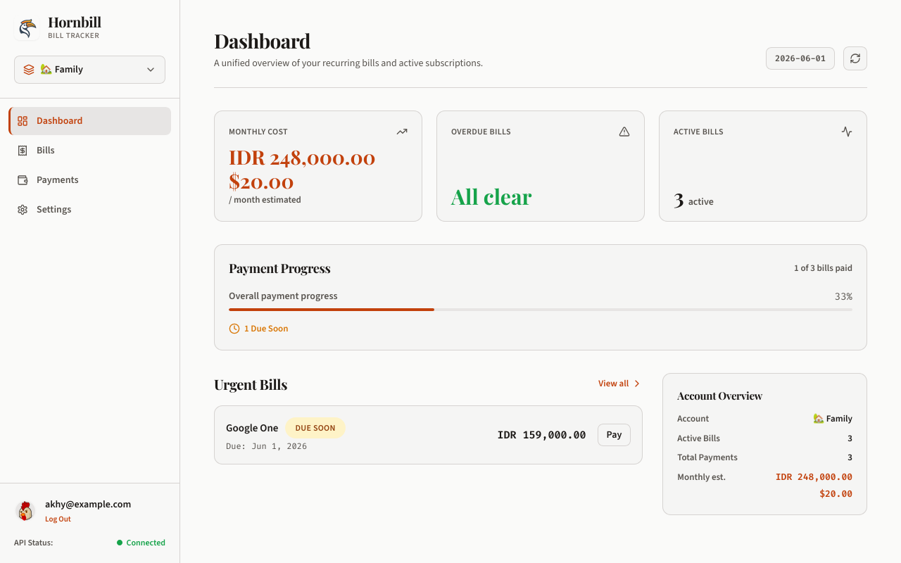
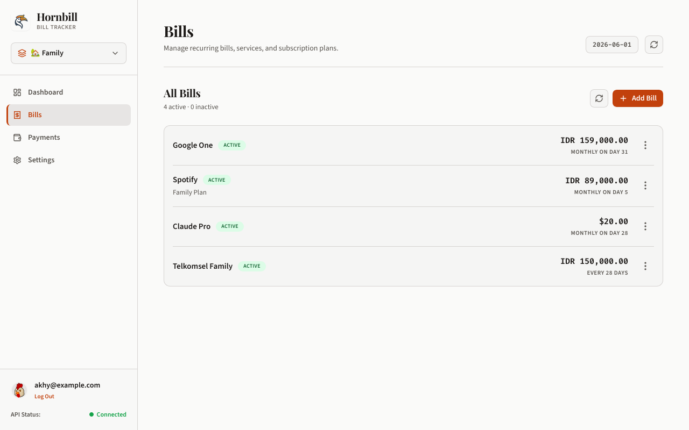

# 🪶 Hornbill


[](https://github.com/chickenzord/hornbill/actions/workflows/ci.yml)
[](https://github.com/chickenzord/hornbill/actions/workflows/docker.yml)
[](https://github.com/chickenzord/hornbill/pkgs/container/hornbill)
[](https://codecov.io/gh/chickenzord/hornbill)
[](https://www.gnu.org/licenses/agpl-3.0)
[](https://bun.sh)


## 🧐 What is Hornbill?

[Hornbill](https://en.wikipedia.org/wiki/Hornbill) (known as **Rangkong** or **Enggang** in [Indonesia](https://id.wikipedia.org/wiki/Rangkong)) is a **self‑hosted personal bill tracker** you can run on a single Docker container. It helps you keep track of recurring bills, upcoming due dates, and payment history.

## 💡 Key Features

- **🔒 Your data stays with you** – stored in a local SQLite database (powered by [Trailbase](https://trailbase.io/)).
- **📅 Flexible recurrence** – configure monthly, yearly, or custom intervals.
- **💱 Multi-currency** – supports tracking bills in multiple currencies.
- **🔔 Reminder notifications** – daily checks and alert notifications via Discord, Slack, Telegram, ntfy, Gotify, or generic Webhooks.
- **📂 Data Export/Import** – export and import your complete profile, bills, and payment records in JSON format at any time.
- **🛡️ Free and open source** – released under the AGPL‑v3.

Hornbill is built for simple self-hosting with a Docker-based setup and a clean, minimalist web UI. It also provides a REST API for integrating with your own services and tools.


## 📸 Screenshots

[](.github/assets/ss_hornbill_dashboard.png)
[](.github/assets/ss_hornbill_bills.png)

## 🚀 Quick Start (Docker)

To run the pre-built image from GitHub Container Registry (GHCR):

```bash
# Run the container (mounts a directory to persist data)
docker run -d \
  -p 3000:3000 -p 4000:4000 \
  -v ./data:/app/data \
  --name hornbill \
  ghcr.io/chickenzord/hornbill:latest
```

### Alternative: Run from Source (Docker Compose)

To build and run the image from the source code, you can use the provided [docker-compose.yml](docker-compose.yml) which builds from the local directory context:

```bash
# Build and run the container in the background
docker compose up -d
```

Open `http://localhost:3000` in your browser to start using Hornbill.

> [!NOTE]
> Hornbill does not manage or provision SSL certificates directly. To run Hornbill securely over HTTPS, it is highly recommended to deploy it behind a reverse proxy. See the [Reverse Proxy & SSL Setup](docs/reverse-proxy.md) guide for Caddy and Nginx configuration templates.


## ⚙️ Configuration (Environment Variables)

| Variable | Description | Default |
|----------|-------------|---------|
| `PORT` | Port for the web UI and API. | `3000` |
| `TRAILBASE_URL` | URL of the embedded SQLite server. | `http://localhost:4000` |
| `TRAILBASE_DATA_DIR` | Path to Trailbase data directory. | `./data/hornbill` |
| `REGISTRATION_ENABLED` | Show sign‑up page (`true`) or hide it (`false`). | `false` |
| `SYNC_INTERVAL_MINUTES` | How often the background job generates payments (minutes). | `1440` |
| `LOG_LEVEL` | Level of logging (`debug`, `info`, `warn`, `error`). | `info` |

## 🔁 Recurrence Models

When creating a bill you can select one of the following recurrence options:

- **One‑time** – a single invoice.
- **Monthly** – billed on a specific day each month (the date is clamped to the last valid day if the month is shorter).
- **Yearly** – billed on a specific month and day once a year (handles leap‑year dates gracefully).
- **Custom Interval** – repeat every **N** days, weeks, or months. You can choose the anchoring strategy:
  - **From Due Date** – the next due date is calculated from the previous due date plus the interval.
  - **From Paid Date** – the next due date is calculated from the actual payment date (`paid_at`) plus the interval, so the schedule shifts based on when you pay.

A background service automatically generates the upcoming payment entries based on these recurrence settings.

## 🎯 Project Vision & Goals

### Core Principles
- **🛡️ Privacy & Simplicity First** – We focus strictly on tracking recurring bills and payment history. Core features must remain lightweight and private.
- **🔌 Extensible Architecture** – Instead of bloating the core app with integrations, we expose a clean REST API so you can connect your own tools, scripts, and agents.
- **🐋 Single-Process Self-Hosting** – Deployment must remain dead-simple. We avoid introducing heavy infrastructure or external database dependencies, keeping Hornbill easy to run in a single container.


### Planned Features
- **Webhook Dispatcher** – Send automated webhook payloads when bills are due or paid.
- **AI agent integration** – Integrations via CLI scripts and agent skills.
- **OAuth login** – Secure authentication options beyond simple password login.
- **Account sharing** – Share accounts and bills with family members or other users.
- **Telegram bot companion** – Interactive bot companion to check due dates and log payments.


### Non-Goals
- **Full Expense & Budget Tracking** – It is not a complete personal finance manager (like YNAB or Firefly III) for tracking daily transactions, envelope budgets, or account balances.
- **Automatic Bank Syncing** – Tracking is entirely manual; there are no bank integrations to automatically pull transaction history.
- **Bill Payment Processing** – Hornbill does not initiate or process actual monetary transactions to pay your bills.

However, since Hornbill provides a comprehensive REST API, you are welcome to build custom integrations (e.g., bank syncing or payment automation) on top of it.


## 🤝 Getting Help

- **Documentation** – see the `docs/` folder for a quick user guide.
- **API Reference** – interactive Scalar API documentation is served at `/docs` (or view raw spec at `/api/v1/openapi.json`).
- **Issues** – open a GitHub issue for bugs or feature requests.
- **Contributing** – feel free to submit pull requests; follow the guidelines in `CONTRIBUTING.md`.

## 🤖 Co-Development

This project is co-developed with **Gemini/Antigravity**, an agentic AI coding assistant. Features, test suites, and documentation are designed in collaborative pair-programming sessions.

## 📄 License

Hornbill is licensed under the **GNU Affero General Public License v3** – see the [LICENSE](LICENSE) file.


